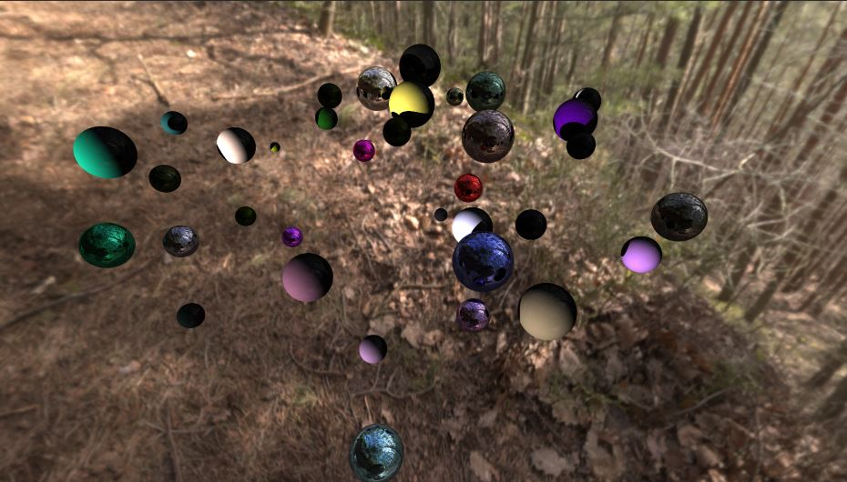

# Ray tracing in Unity

## This project's goals
- Learning how to use HLSL
- Exploring the ray tracing process

## Next steps
- Adding diffuse interreflection, glossy reflections and soft shadows

| | | |
|-- |-- |--|
| | Result after finishing the first part of  David Kuri's [GPU Ray Tracing in Unity](http://three-eyed-games.com/2018/05/03/gpu-ray-tracing-in-unity-part-1/).||
